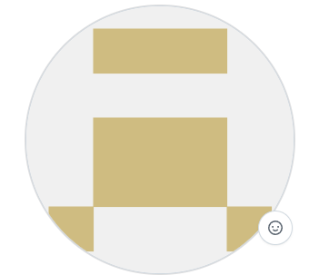

# Yahor Savitski

## Future Frontend Developer
---

**Contact information:**
- **Phone:** +375 29 114 3604
+ **E-mail:** egorushka.sova@gmail.com
* **Telegram:** @YahorSav
+ **Discord:** @egor_sav
---

**About Myself:**
I'm currently studying at an engineering university.    
During my studies, I realized that I have a strong interest in trying myself in frontend development. Because of that, I watched several videos on the topic and even tried building a small [website](https://github.com/Egor834/Egor834.github.io).  
While searching for courses, I came across RS School. I hope to complete it, learn a lot of new things, gain experience working in a team, and meet many interesting people.  
I believe, that my ability to learn and to gain new skills will lead me through this path of becoming a Frontend Developer. >

**Skills and Proficiency:**
- HTML5, CSS3
* C, C++ Basics
+ Git, GitHub
* VS Code
---

**Code example:**
**Task from Codewars:** *Write a function "greet" that returns "hello world!"*

`function greet () {
  return"hello world!";
}`
---

**My training:**
Third-year student at BSUIR majoring in computer engineering.
---

**Languages:**
- English - A2
* Russian - Native
+ Belarusian - Native
